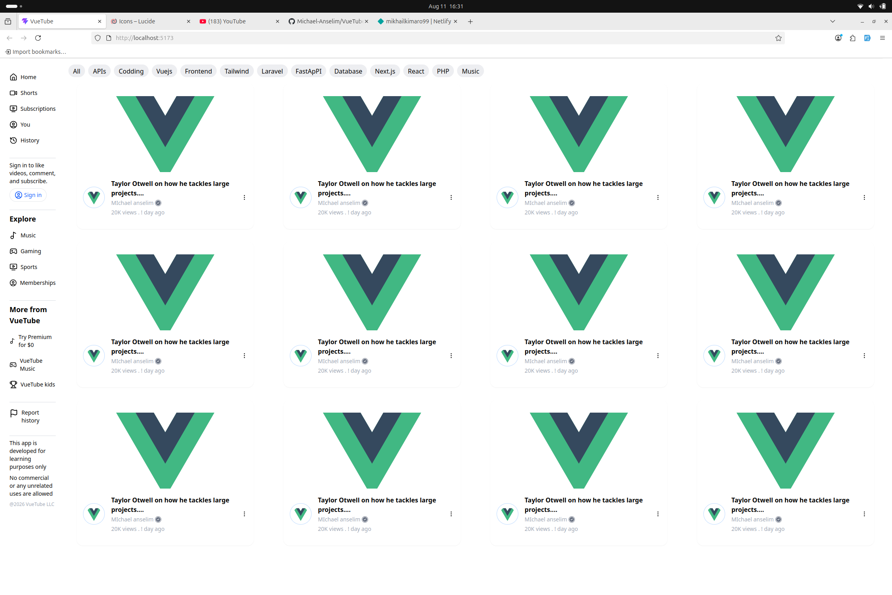

# Vue 3 + Vite

# 🎥 VueTube Clone

A simple **YouTube-inspired clone** built with **Vue.js** as a personal project to practice and improve my frontend development skills. This is a demo application focused on recreating the look and feel of YouTube while exploring Vue's core concepts.

## 🚀 About the Project

This project was created as a hands-on challenge to strengthen my understanding of Vue.js and modern frontend development. The goal wasn't to build a production-ready platform but to test my ability to structure components, manage state, and create a responsive user interface.

## ✨ Features

- 🎬 YouTube-inspired homepage
- 📺 Video cards and responsive layout -- not yest responsive
- 🔍 Search interface (UI/demo) -- still at its ugly stages
- 📱 Responsive design for desktop and .. just desktop for now
- 🧩 Reusable Vue components
- ⚡ Fast development using Vue

> **Note:** This is a demo project intended for learning purposes. It does not include a backend, user authentication, video uploads, or other production-level YouTube functionality.

## 🛠️ Built With

- Vue.js
- JavaScript
- HTML5
- Tailwindcss V4

## 📦 Installation

Clone the repository:

````bash
git clone  https://github.com/Michael-Anselim/VueTube.git```

Navigate to the project folder:

```bash
cd VueTube
````

Install dependencies:

```bash
npm install
```

Start the development server:

```bash
npm run dev
```

## 📚 What I Learned

Through this project, I practiced:

- Building reusable Vue components
- Component communication
- Project structure and organization
- Responsive UI design
- Working with Vue's reactive system
- Improving overall frontend development skills

## 🔮 Future Improvements

- User authentication
- Dark/Light mode toggle
- Better state management
- Loading skeletons and error handling

## 📸 Preview

![alt text]

## 🤝 Contributing

This project is primarily for learning, but suggestions and feedback are always welcome.

## 📄 License

This project is open-source and available under the MIT License.

---

**Made with Vue.js as a learning project to challenge myself and improve my frontend development skills.**
